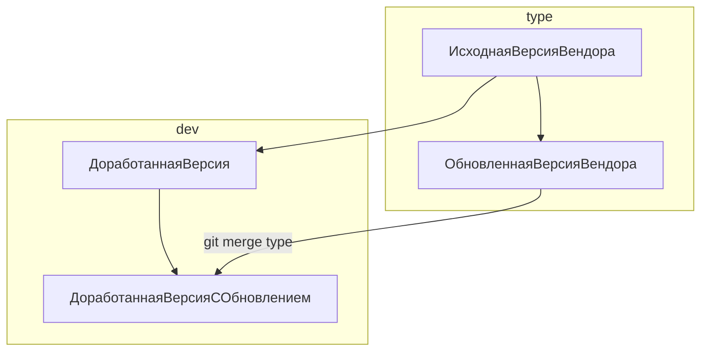

# 1С, обновление поставщика, GIT и ИИ

Это статья о практике обновления измененных конфигураций 1С новыми поставками от вендора с применением GIT и о применении ИИ для этого.
Речь идет именно об использовании GIT совместно с конфигуратором, не про EDT.

## Суть

Сам процесс описан вот в это видео от "Желтого клуба": [Обновление нетиповой 1С 8.3 от профессионала. Новый метод обновления 1С](https://www.youtube.com/watch?v=nRgHHt4Cu18)

Вот суммаризация этого видео [Обновление1СЧерезGIT.summary.md](docs/Обновление1СЧерезGIT.summary.md)

Ну и транскрибация, можно скормить ЛЛМ и проанализировать в нужном разрезе [Обновление1СЧерезGIT.speaker_transcriptions.csv](docs/Обновление1СЧерезGIT.speaker_transcriptions.csv)

Кратко метод заключается в том, что работа происходит с выгрузкой конфигурации 1С в файлы, а эта выгрузка индексируется в GIT. Создается две ветки, вендора - `type` и измененной конфигурации `dev`. Названия условные, можно как угодно. Первый коммит в `type` исходная версия поставщика, второй коммит в `type` обновленная версия поставщика. От первого коммита создать ветку `dev`, в нее выгрузить доработанную версию. Получаем структуру, которая аналогична той что в конфигураторе. Не помню как точно, вроде "Старая конфигурация поставщика, Новая конфигурация поставщика, Основная конфигурация".
Потом выполняется команда `git merge type`, и все что может объединиться объединяется. Для остального надо разрешить конфликты в ручную или скриптами или ИИ. Про ИИ возможно, 99% что да, но сам, увы не попробовал. ИИ мне чинил то, что я вручную поломал, думаю он и с мерджем справился бы за несколько итераций.

На схеме ниже что примерно должно получиться в репозитарии:



Эту схему можно исполнить как при ведении разработки в GIT, так и собрав такую структуру временно, только под обновление.

Подробно останавливаться на методе я не буду, он достаточно тривиален и больше упирается в знание GIT. Далее я буду останавливаться на вопросах, которые в этом процессе решаются ИИ. Спойлер: почти все, хотя лично сам я много сделал вручную, можно было сильно сэкономить время.

### Плюсы и минусы в сравнении с обновлением через конфигуратор

- `+++` Использование ИИ для помощи в обновлении. С конфигуратором ИИ не работает;
- `+` GIT репозитарий в состоянии MERGE может существовать бесконечно долго. Если закрыть конфигуратор или окно объединения все результаты будут потеряны. В конфигураторе, конечно, есть функция сохранять настройки объединения в файл, но вобще это морока;
- `+` Для обработки кодовой базы можно применять скрипты. ИИ здесь как рыба в воде, напишет все что
попросишь. А в конфигураторе скриптов нет, только биоробот мышка кликать.
- `+` Объединение измененных ролей. В конфигураторе нельзя сравнить роли. В git в xml все видно. Типовые роли менять не надо! За это в ад, водить мусоровоз до конца времен. Но бывает.
- `-` Часть конфликтов будет в файлах `.xml`. Для их ручного исправления надо наработать навык, сначала будет много косяков. Впрочем, это то, что ИИ исправляет хорошо;
- `-` Слияние макетов табличных документов практически не возможно, продраться через тучу тегов в XML макета тяжело.
- `-` Программы сравнения не умеют сравнивать код 1С по процедурам. Конфигуратор умеет, если использовать встроенный редактор;
- `-` Придется снять конфигурацию с поддержки. Особенно если это репозитарий с живой разработкой, а не созданный конкретно под обновление. GIT не любит большие бинарные файлы, а поддержка включает в себя полный `.cf` конфигурации поставщика. Кроме того это отрицательно влияет на выгрузку и загрузку конфигурации в файлы, чисто из-за лишнего объема перекачиваемых файлов. Восстановить поддержку потом можно, но с нюансами. Тему с поддержкой в GIT надо расписывать отдельно.
- `-` git merge часто дает иногда ложные конфликты. Особенно в файлах справки. Решается скриптами.
- `-` при изменении версии платформы или режима совместимости ветка `type` может протухнуть, т.к. количество конфликтов будет просто зашкаливать, из-за изменения структуры файлов выгрузки. Эту ветку надо быть готовым в любой момент пересоздать.
- `-` После загрузки файлов из конфигурации на некоторых версиях можно словить баг, когда конфигуратор при сравнении с конфигурацией поставщика будет показывать что почти все формы изменены, хотя по факту там все нормально. Вот здесь описание этого бага для EDT [https://github.com/1C-Company/1c-edt-issues/issues/1531](https://github.com/1C-Company/1c-edt-issues/issues/1531), но на конфигураторе можно тоже самое словить, я знаю. Но у этого есть и плюс - придется таки научиться обновлять через GIT.
- `-` Ни и вобще надо быть готовым к самым странным ошибкам, про которые ничего нет в интернете. Это не критично, GIT всегда может откатить файлы к исходному состоянию. И оказалось что ИИ вполне успешно решает такие ошибки.

## Кейс

УНФ, не обновлялась с 2019 года, отставание от вендора 16 релизов. Изменения в конфигурации, в двух расширениях и в куче печатных форм. Сделана кустарная локализация для РБ.

Кто-то при обновлении наделал в модулях моржей, все модули в тегах MRG. После чего накатил еще пару релизов частично, без поддержки. Т.е. было даже не понятно, какая на самом деле там версия.

Моржей я вычистил и определил базовый релиз за пару дней. ИИ это сделал бы за пару часов наверное, но тогда я не умел.

Перечень изменений и их цель нигде не были зафиксированы, поэтому почти все узнавал от пользователей, когда ломал. Документировал, писал тесты, рефакторил. Плакал о загубленной карме.

В плюсе было только то, что использовался минимум функционала, фактически только CRM, выписка документов и некоторые отчеты. Это позволило пропустить полное обновление через 16 релизов, и обойтись тремя. А подсказал мне это ИИ. При починке одного из обработчиков обновлений, стало понятно, что обработчики версии 3.0.12 допускают обновление с 1.6.25. До нее было два релиза, и третий на 3.0.12. Т.к. функционала использовался минимум, я попросил проанализировать, есть ли удаляемые реквизиты в используемых объектах, ИИ таких не нашел. И я рискнул обновиться сразу через 12 релизов, и получилось. Если бы не получилось, попросил бы исследовать подробнее, через какие можно. Это везение, что разработчики УНФ так сделали.

На ИИ в этом проекте не полагался, у меня был план плотно заняться им после завершения. Поэтому многое делал руками, сейчас бы уже отдал это ИИ и сэкономил бы наверное недели две, а то и месяц.

Началась эта история в ноябре, закончил в начале апреля. Основная часть работы это рефакторинг и добыча из пользователей информации что, где и зачем. Само обновление наверное неделю чистого времени заняло.

## Подготовка кода к обновлению

Кроме общеизвестных подходов, облегчающих обновление, при обновлении через GIT надо стремиться чтобы при выполнении `git merge` количество конфликтов было минимально, а те конфликты что есть, разрешались бы с минимальными усилиями.

Это можно делать в цикле: `git merge` —> посмотреть что не так —> `git merge --abort` —> поправить —> снова `git merge`. Так по кругу, до достижения удовлетворительного результата. Понятное дело, что для ИИ поправить/отрефакторить основное занятие.

## Сборка ветки поставщика `type`

Я в этом проекте не пользовался скриптами автоматической сборки, обошелся малой кровью, и вместо 16 релизов было только 3. Загрузил руками. Но есть решения:

- [Yet another release downloader (YARD) - https://github.com/arkuznetsov/yard](https://github.com/arkuznetsov/yard) - у меня не заработало, поэтому написал свое;
- [КачайСтройВеткуПоставщика.os](docs/КачайСтройВеткуПоставщика.os) - Вот это свое. Ищет на сайте 1С следующий релиз, скачивает, устанавливает, загружает в GIT, делает коммит. Через пару часов имеем последовательную ветку релизов. Писано еще руками, уже год как не использовал, может тоже не работает.

Но если скрипт не работает, все ведь знают что делать )))

## GIT MERGE

Итак, выполнили `git merge`, что-то объединилось само, что-то осталось в конфликтах.
Тут ИИ сильно помог. Во первых, я попроси ИИ провести исследование, какие есть стратегии мерджа GIT и какая из них даст наименьшее количество конфликтов. Победила команда `git merge -Xignore-space-change`.

И попросил написать скрипт, который автоматически разрешает конфликты, правила для которых понятны:[vendor-resolve-conflicts.sh](docs/vendor-resolve-conflicts.sh)

- Все что удалил и добавил вендор разрешать как `theirs`;
- Все что попало в конфликты, и где нет маркера-префикса изменений `яя_`, разрешать как `theirs`;
- Все файлы, которые в проекте принято не менять, разрешать как `theirs`. Туда идут файлы справки, картинки, макеты, формы, роли, подсистемы и т.п.;
- Макеты драйверов торгового оборудования разрешать как `ours`. Я их с помощью ИИ заменил на пустые zip-архивы, чтобы размер `cf` срезать и в git мусор не хранить;
- Все наши объекты с префиксом `яя_` разрешать как `ours`

Ну и так далее. В результате работы скрипта остаются файлы, которые требуют ручного слияния, но их сильно меньше. Далее наверное на это можно было натравить ИИ, и он бы сам все поправил. Сейчас я в этом уверен, но тогда не был, и делал все вручную. Уверен сейчас потому, что я накосячил, а ИИ мне все ошибки поправил, я ему просто кидал тексты ошибок. И появились статьи, где люди сливали измененные модули 1С просто в чате, и вполне успешно. Так что с документацией, харнесом и GIT ИИ точно справиться.

А вот собирал скрипты и нашел еще такой: [fix-case-merge.sh](docs/fix-case-merge.sh). Вобщем, этот скрипт решал баг git для винды. Надо было бы это тоже в минусы git по сравнению с конфигуратором, но там и так много. Распугаю людей совсем.

Суть в том, что иногда в 1С переименовывают объект, исправляют строчные буквы на прописные. 1С это все равно, а вот git на винде начинает трекать оба файла. `абыр` и `Абыр` для него это разное. `git merge` перестает работать. Вот ИИ написал скрипт чтобы это вылечить, сам разобрался в чем косяк, сам написал. Скрипт разовый, просто как пример где ИИ помогает.

## Тестирование

Если обновлять одну и ту же конфигурацию несколько раз, тесты будут очень полезны. Потому что в измененных конфигурациях почти всегда есть гнилые места, которые обязательно будут пропущены. Нашел такое - написал тест, при следующей итерации спокоен

Тесты писать жутко скучно. Но это пока ИИ не было. Без ИИ не писал бы. 
Тесты предельно примитивные, без фреймворков. Каждый тест это процедура, которая что-то проверяет. Если проверка не проходит, процедура вызывает исключение. Если проходит - ничего не делает. Процедура самодостаточна, можно использовать без инфраструктуры, просто вызвать.

Процедуры собраны в модули, ниже приведены примеры модулей.

Серверные тесты: [docs/examples/conf/CommonModules/яя_тестыСервер/Ext/Module.bsl](docs/examples/conf/CommonModules/яя_тестыСервер/Ext/Module.bsl)

Клиентские тесты: [docs/examples/conf/CommonModules/яя_тестыКлиент/Ext/Module.bsl](docs/examples/conf/CommonModules/яя_тестыКлиент/Ext/Module.bsl)

Тесты печати: [docs/examples/conf/CommonModules/яя_тестыПечать/Ext/Module.bsl](docs/examples/conf/CommonModules/яя_тестыПечать/Ext/Module.bsl)

Я в тестировании не разбираюсь, поэтому не знаю как это называется. ИИ говорит что это **Модульные тесты 1С**, ему виднее.

Тесты примитивные их мало, по времени они окупились многократно. Основа тестирования у меня это самый популярный в 1С User-driven testing, так вот эти user стали мне сильно меньше слать report и hate.

Большинство тестов написано ИИ. Списки тестов поддерживает ИИ самостоятельно, просто функция возвращающая список имен тестов, обновляется при добавлении каждого нового теста. Тесты писал по ходу столкновения с проблемами. Иногда openspec добавляет тесты, но обычно это фуфло, сношу их.

Скилл по тестам написан ИИ после косяков, сама накосячила, сама исправила, сама написала док [docs/1c-test-creation-skill.md](docs/1c-test-creation-skill.md)

## Что по ИИ?

У меня был куплен курсор, в феврале добавил CLAUDE по подписке 20$
Для задач по доработке в основном использовал Gemini и Sonnet. Разницы в качестве не заметил. Для скриптов и аналитики кода довольно много использовал grok 4.1, он был очень дешевый, считай бесплатно работал, качество было ок. Grock 4.2 уже сильно дороже, не имеет смысла. Зато появился composer2, скрипты и анализ кода делает хорошо, да 1С делает нормально, часто добивал им задачи, когда в лимиты CLAUDE упирался.

MCP Нет. Ставил, но не привык. Долгая индексация и баги большой оверхэд. Контроль состояния докера и MCP сервисов перед каждой сессией. Дополнительная документация. Массовые изменения конфигурации вселяли сомнения по корректности использования ранее индексированных данных. Времени разбираться не было, надо было пилить обновление, а модели вполне норм работали без MCP и я забил. Соннет не ошибается в синтаксисе 1С. Gemini почти не ошибается. Composer2 нормально работает на задачах типа восстановления снесенного обновлением функционала.

Для поиска по кодовой базе GREP вполне устраивает, особенно после того как документация наросла. Стараюсь при постановке задачи писать точные названия конкретных объектов и методов, чтобы оптимизировать поиск.

Не хватало только MCP для анализа данных из 1С. Для решения вопросов типа: заполнен ли этот реквизит в актуальных документах и справочниках? Поленился внедрить, ходил в консоль запросов писать руками. Если бы сделал, конечно удалось бы снести еще много дохлых реквизитов.

Прижился [context7](https://context7.com). Настроил и работает. Модели используют когда задачи не 1С, скрипты и инструменты пишут. Пару раз и для 1С что-то смотрели, ну знаю уж помогло им это или нет.

Для новых функций использовал `openspec`

Для загрузки изменений ИИ написал скрипт, который грузит загружает в конфигурацию только то, что в git unstaged, staged и untracked. Без него загрузка полной конфигурации очень раздражает, даже на маленькой УНФ. С ним это 10-15 секунд. Скрипт гасит конфигуратор, загружает измененные файлы, запускает конфигуратор снова. [load-changed-files.sh](docs/load-changed-files.sh).

Очень полезным оказался [RTK](https://www.rtk-ai.app/) (Rust Token Killer) — CLI-прокси, для сжатия вывода типовых bash-команд. Вот статистика `RTK gain`. Как видно, для операций с git вполне себе экономит токены.

```
RTK Token Savings (Global Scope)
════════════════════════════════════════════════════════════

Total commands:    863
Input tokens:      19.2M
Output tokens:     7.7M
Tokens saved:      11.5M (59.9%)
Total exec time:   27m35s (avg 1.9s)
Efficiency meter: ██████████████░░░░░░░░░░ 59.9%

By Command
────────────────────────────────────────────────────────────────────────
  #  Command                   Count   Saved    Avg%    Time  Impact    
────────────────────────────────────────────────────────────────────────
 1.  rtk git status               44    4.6M   72.7%    2.0s  ██████████
 2.  rtk git diff                  5    3.7M   50.4%   977ms  ████████░░
 3.  rtk git diff --staged...      3  821.8K   55.0%   232ms  ██░░░░░░░░
 4.  rtk git diff --staged...      1  797.6K   99.7%   192ms  ██░░░░░░░░
 5.  rtk grep                     20  522.1K   29.9%    9.1s  █░░░░░░░░░
 6.  rtk git diff 89c13cd7...      1  344.3K   96.9%   213ms  █░░░░░░░░░
 7.  rtk git diff --staged         7  248.6K   81.9%   198ms  █░░░░░░░░░
 8.  rtk diff                      1  180.6K  100.0%     3ms  ░░░░░░░░░░
 9.  rtk git show 0ca6670d...      1  107.6K   92.0%   386ms  ░░░░░░░░░░
10.  rtk git show 68ee88b0...      1   66.9K   96.4%   395ms  ░░░░░░░░░░
────────────────────────────────────────────────────────────────────────
```
